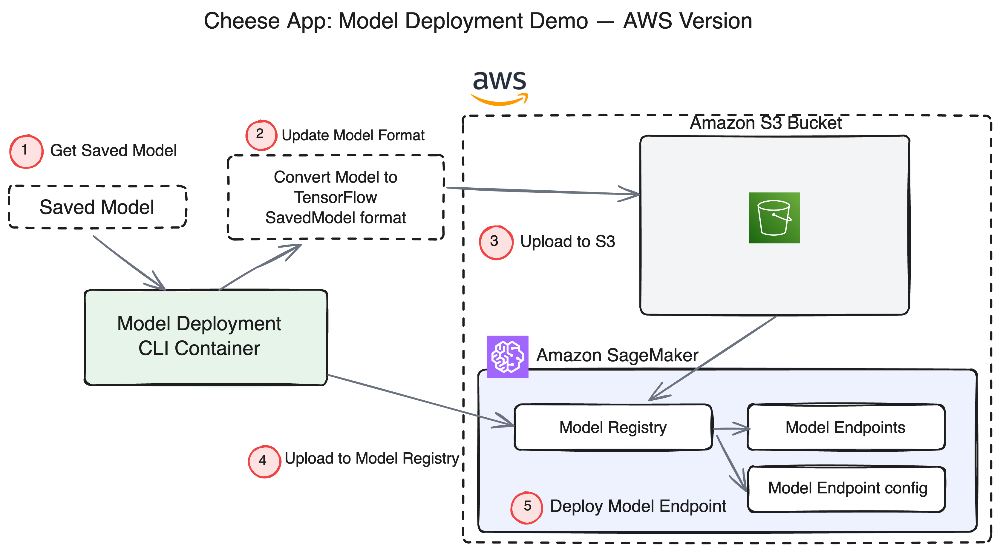

# Cheese App: Model Deployment Demo - AWS Version

In this tutorial we will deploy a model to AWS SageMaker:


> Note: The architecture diagram shows the GCP workflow. For AWS, we use:
> - Amazon S3 instead of Google Cloud Storage
> - Amazon SageMaker instead of Vertex AI
> - AWS IAM instead of GCP Service Accounts

## Setup Environments
In this tutorial we will setup a container to manage building and deploying models to AWS SageMaker Model Registry and Endpoints.

### Clone the github repository
- Clone or download from [here](https://github.com/dlops-io/model-deployment)

### AWS Services to Enable
Make sure you have access to the following AWS services:
* Amazon S3
* Amazon SageMaker
* AWS IAM

### Setup AWS Credentials
Next step is to enable our container to have access to S3 buckets & SageMaker in AWS.

#### Create a local **secrets** folder

It is important to note that we do not want any secure information in Git. So we will manage these files outside of the git folder. At the same level as the `model-deployment-aws` folder create a folder called **secrets**

Your folder structure should look like this:
```
   |-model-deployment-aws
   |-secrets
```

#### Setup AWS IAM User and Credentials

##### Option 1: Using AWS IAM User (Recommended for local development)
1. Go to the [AWS Console](https://console.aws.amazon.com/)
2. Navigate to IAM (Identity and Access Management)
3. Create a new IAM user called "model-deployment"
4. Attach the following policies:
   - `AmazonS3FullAccess`
   - `AmazonSageMakerFullAccess`
   - `IAMFullAccess` (needed for SageMaker to create execution roles)
5. Create access keys for this user
6. Save the Access Key ID and Secret Access Key

##### Option 2: Using AWS IAM Role (For EC2 or SageMaker instances)
1. Create an IAM role with the same permissions as above
2. Attach it to your EC2 instance or SageMaker notebook instance

#### Configure AWS Credentials

You have several options to provide AWS credentials:

##### Option 1: AWS CLI Configuration (Recommended)
Run the following command on your local machine:
```bash
aws configure
```
Enter your:
- AWS Access Key ID
- AWS Secret Access Key
- Default region (e.g., us-east-1)
- Default output format (json)

This will create `~/.aws/credentials` and `~/.aws/config` files that will be mounted into the container.

##### Option 2: Environment Variables
Export the following environment variables before running the container:
```bash
export AWS_ACCESS_KEY_ID=your_access_key_id
export AWS_SECRET_ACCESS_KEY=your_secret_access_key
export AWS_REGION=us-east-1
```

#### Create SageMaker Execution Role

SageMaker needs an execution role to access AWS resources on your behalf:

1. Go to the AWS Console > IAM > Roles
2. Click "Create role"
3. Choose "SageMaker" as the trusted entity
4. Attach the following policies:
   - `AmazonSageMakerFullAccess`
   - `AmazonS3FullAccess`
5. Name the role "SageMakerExecutionRole"
6. Copy the Role ARN (it will look like: `arn:aws:iam::123456789012:role/SageMakerExecutionRole`)
7. Save this ARN - you'll need it for the SAGEMAKER_ROLE environment variable

### Create S3 Bucket

We need a bucket to store the saved model files that will be used by SageMaker to deploy models.

- Go to `https://console.aws.amazon.com/s3/`
- Create a bucket `cheese-app-models-demo` [REPLACE WITH YOUR UNIQUE BUCKET NAME]
  - Note: S3 bucket names must be globally unique across all AWS accounts

## Run Container

### ⚠️ SECURITY WARNING
**NEVER hardcode AWS credentials directly in scripts or commit them to Git!**
If you see credentials in any script files, remove them immediately.

### Set Up AWS Credentials Securely

We've provided a helper script to set up your AWS credentials securely:

```bash
bash setup-aws-credentials.sh
```

**The script offers three options:**

1. **Use existing AWS CLI configuration** (`~/.aws/credentials`)
   - Choose this if you've already run `aws configure`
   - Your existing credentials will be used automatically

2. **Set environment variables temporarily**
   - Credentials are set for the current terminal session only
   - Good for testing or one-time use
   - You'll need to re-enter them each time you open a new terminal

3. **Create a secure secrets file** (Recommended)
   - Creates `../secrets/aws-credentials.sh` with your credentials
   - File is protected with restrictive permissions (600)
   - Automatically loaded by `docker-shell.sh`
   - Persists between sessions but stays outside your git repository

**What you'll need to provide:**
- AWS Access Key ID (from your IAM user)
- AWS Secret Access Key (from your IAM user)
- AWS Region (default: us-east-1)
- SageMaker Execution Role ARN (the role you created earlier)

**Example SageMaker Role ARN format:**
```
arn:aws:iam::123456789012:role/service-role/AmazonSageMaker-ExecutionRole
```

### Update Configuration

Edit `docker-shell.sh` if needed to update:
- `S3_MODELS_BUCKET_NAME`: Your S3 bucket name
- `AWS_REGION`: Your preferred AWS region (default: us-east-1)

### Quick Start Commands

Once you've set up your credentials, here's the typical workflow:

```bash
# 1. Set up credentials (first time only)
bash setup-aws-credentials.sh

# 2. Build and run the container
sh docker-shell.sh

# 3. Inside the container, prepare and deploy your model
python cli.py --prepare
python cli.py --deploy
python cli.py --predict
```

### Run `docker-shell.sh`
Based on your OS, run the startup script to make building & running the container easy

- Make sure you are inside the `model-deployment-aws` folder and open a terminal at this location
- Run `sh docker-shell.sh`

**Note:** The script will automatically:
- Load your AWS credentials from the secrets file (if it exists)
- Build the Docker image with the correct AWS packages
- Mount your AWS credentials into the container
- Start the container with all necessary environment variables

### Prepare Model for Deployment
Our model weights are stored following the serverless training we did in the previous tutorials. In this step, we'll download the model and then upload it to an S3 bucket, enabling SageMaker to access it for deployment to an endpoint.

Since accessing WandB requires permission to Pavlos account, we've instead moved the model to GitHub. In cli.py, you'll see the code for downloading from WandB is commented out to reflect this adjustment.

* Run `python cli.py --prepare`, this will:
  1. Download the model from GitHub
  2. Prepare the model in TensorFlow SavedModel format
  3. Package it as model.tar.gz (required by SageMaker)
  4. Upload to the specified S3 bucket

### Upload & Deploy Model to SageMaker
In this step we create a SageMaker model and deploy it as an endpoint.

* Run `python cli.py --deploy`, this will:
  1. Create a SageMaker model from the S3 artifacts
  2. Deploy the model to a SageMaker endpoint
  3. Save the endpoint configuration to `endpoint_config.json`

* This will take several minutes to complete (typically 5-10 minutes)
* Once the model has been deployed, the endpoint name will be displayed
* The endpoint configuration will be saved to `endpoint_config.json` for future use

### Test Predictions

* Run `python cli.py --predict`
* The script will automatically load the endpoint configuration from `endpoint_config.json`
* You should see results similar to this:
```
Predict using endpoint
image_files: ['data/brie-1.jpg', 'data/brie-2.jpg', 'data/gouda-1.jpg', 'data/gouda-2.jpeg', 'data/gruyere-1.jpg']
Image: data/brie-2.jpg
Result: {'predictions': [[0.0887121782, 0.0439011417, 0.867386699]]}
[0.0887121782, 0.0439011417, 0.867386699] 2
Label:    brie 

Image: data/gouda-1.jpg
Result: {'predictions': [[0.986440122, 0.00689249625, 0.0066674049]]}
[0.986440122, 0.00689249625, 0.0066674049] 0
Label:    gouda 
```

## Clean Up Resources

To avoid ongoing charges, make sure to delete the SageMaker endpoint when you're done:

### Using AWS Console:
1. Go to SageMaker > Endpoints
2. Select your endpoint
3. Click "Delete"

### Using AWS CLI:
```bash
aws sagemaker delete-endpoint --endpoint-name <your-endpoint-name>
aws sagemaker delete-endpoint-config --endpoint-config-name <your-endpoint-config-name>
aws sagemaker delete-model --model-name <your-model-name>
```

## Cost Considerations

- **S3 Storage**: Minimal cost for storing model artifacts
- **SageMaker Endpoint**: Charged per hour while the endpoint is running
  - ml.m5.xlarge instance: ~$0.23 per hour
  - Remember to delete endpoints when not in use
- **Data Transfer**: Minimal costs for predictions

## Troubleshooting

### Common Issues:

1. **Permission Denied Errors**:
   - Ensure your IAM user/role has the necessary permissions
   - Check that the SageMaker execution role has access to S3

2. **Endpoint Creation Fails**:
   - Verify the model.tar.gz was uploaded correctly to S3
   - Check CloudWatch logs for detailed error messages

3. **Predictions Fail**:
   - Ensure the endpoint is in "InService" status
   - Verify the input format matches what the model expects
   - Check that image files exist in the data directory

4. **S3 Bucket Already Exists**:
   - S3 bucket names must be globally unique
   - Choose a different bucket name with your unique identifier

## Additional Resources

- [AWS SageMaker Documentation](https://docs.aws.amazon.com/sagemaker/)
- [SageMaker TensorFlow Serving](https://sagemaker.readthedocs.io/en/stable/frameworks/tensorflow/deploying_tensorflow_serving.html)
- [AWS S3 Documentation](https://docs.aws.amazon.com/s3/)
- [AWS IAM Best Practices](https://docs.aws.amazon.com/IAM/latest/UserGuide/best-practices.html)